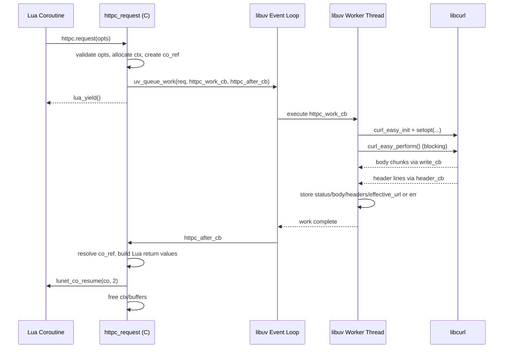

# `httpc` Runtime Engineering (Current State)

This document describes how `ext/httpc/httpc.c` is built and executed **today** in Lunet.

## Scope

- Module: `lunet.httpc`
- Source: `ext/httpc/httpc.c`
- Build target: `lunet-httpc` in `xmake.lua`
- Runtime model: Lua coroutine API over `libuv` worker thread + `libcurl` blocking call

## Build Wiring

`lunet-httpc` is built as a shared Lua module (`lunet/httpc.so` or `.dll`) with:

- Core runtime sources (`core_sources`, includes `src/main.c`, `src/co.c`, `src/lunet_mem.c`, etc.)
- `ext/httpc/httpc.c`
- Packages: `luajit`, `libuv`, `curl`
- Defines:
  - Always: `LUNET_NO_MAIN`, `LUNET_HTTPC`
  - Optional: `LUNET_TRACE`, `LUNET_TRACE_VERBOSE`
  - Optional shim: `LUNET_HTTPC_ALLOC_SHIM`
  - Optional EasyMem path via global build options (`LUNET_EASY_MEMORY`, diagnostics define)

Key consequence: `httpc` runs inside the same Lunet C runtime model as other modules and resumes Lua coroutines through Lunet's coroutine wrappers.

## Current Request Execution Path

### 1. Lua entry

Lua calls:

```lua
local httpc = require("lunet.httpc")
local resp, err = httpc.request({ ... })
```

`httpc.request` must run in a yieldable coroutine.

### 2. C-side request setup (`httpc_request`)

- Validates options table
- Parses request fields: `url`, `method`, `body`, `headers`, `timeout_ms`, `max_body_bytes`, `insecure`
- Allocates and fills `httpc_req_t` context
- Anchors calling coroutine in Lua registry (`co_ref`)
- Queues work to libuv threadpool: `uv_queue_work(...)`
- Yields coroutine immediately: `return lua_yield(L, 0)`

### 3. Worker thread execution (`httpc_work_cb`)

On libuv worker thread:

- `curl_easy_init()`
- Sets curl options (`URL`, follow redirects, timeout, UA, TLS verify policy)
- Attaches write callback (`httpc_write_cb`) for body collection
- Attaches header callback (`httpc_header_cb`) for header line capture
- Calls blocking `curl_easy_perform()`
- Stores either error info or response info (status, effective URL, headers/body buffers)

### 4. Main loop continuation (`httpc_after_cb`)

Back on event-loop thread:

- Resolves anchored coroutine by `co_ref`
- Pushes response table or error tuple (`nil, err`)
- Resumes coroutine via `lunet_co_resume(co, 2)`
- Frees request context and buffers

## Concurrency Model

- `httpc` uses `uv_queue_work`, so each request runs as a blocking curl operation on a libuv worker thread.
- Concurrency therefore follows libuv threadpool capacity (`UV_THREADPOOL_SIZE`; default is typically 4 unless overridden).
- Event loop thread remains non-blocking for scheduling/resume, but throughput is bounded by worker thread availability and remote I/O latency.

## Memory/Allocator Model (Current)

In current code:

- `httpc` internal buffers go through `HTTPC_ALLOC/REALLOC/FREE` macros.
- With shim disabled:
  - These map to Lunet allocator wrappers (`lunet_alloc`, `lunet_realloc`, `lunet_free_nonnull`).
- With shim enabled (`LUNET_HTTPC_ALLOC_SHIM`):
  - Same underlying allocator path, plus per-allocation bookkeeping counters and summary output (`[HTTPC_ALLOC] SUMMARY ...`).
- If EasyMem build options are enabled globally:
  - Lunet allocator wrappers route to EasyMem backend (plus diagnostics in experimental mode).

No per-request independent EasyMem instance is currently created in `httpc`; allocation strategy is process-level through Lunet allocator wrappers.

## Component Diagram

```mermaid
flowchart LR
    A[Lua coroutine\nhttpc.request(opts)] --> B[ext/httpc/httpc.c\nhttpc_request]
    B --> C[Lunet coroutine anchor\nregistry co_ref]
    B --> D[libuv default loop]
    D --> E[libuv threadpool\nuv_queue_work]
    E --> F[libcurl easy handle\nblocking I/O]
    F --> G[Body/Header callbacks\naccumulate buffers]
    E --> H[httpc_after_cb\nmain event loop thread]
    H --> I[lunet_co_resume]
    I --> J[Lua receives\nresp or err]

    K[HTTPC_ALLOC macros] --> L[lunet_mem wrappers]
    L --> M[libc allocator]
    L --> N[EasyMem backend\nif enabled]
```

## Sequence Diagram



## What This Means Right Now

- `httpc` is engineered as coroutine-friendly async facade over blocking `libcurl` executed in libuv worker threads.
- It is not a non-blocking socket-level HTTP client; it is threadpool-mediated blocking I/O.
- Allocation behavior can be observed with shim counters and with EasyMem diagnostics, but the runtime path itself remains the same.
